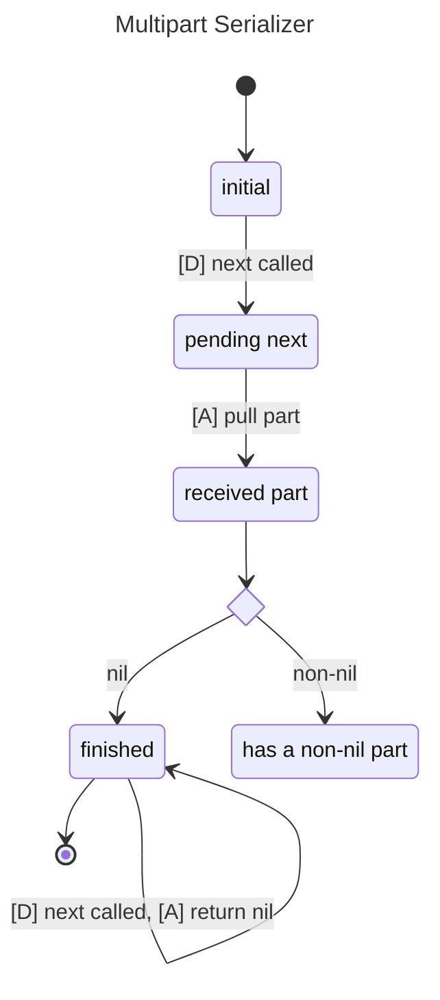

# Multipart parsing

- Available methods on the parser:
    - `next called`: called by the consumer

- Available actions made by the parser:
    - `pull part`: pull a part from the upstream iterator
    - `return nil`: return nil (end of sequence)
    - `return chunk`: return a chunk
